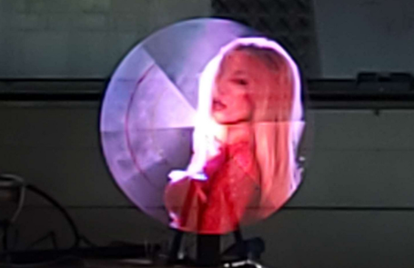
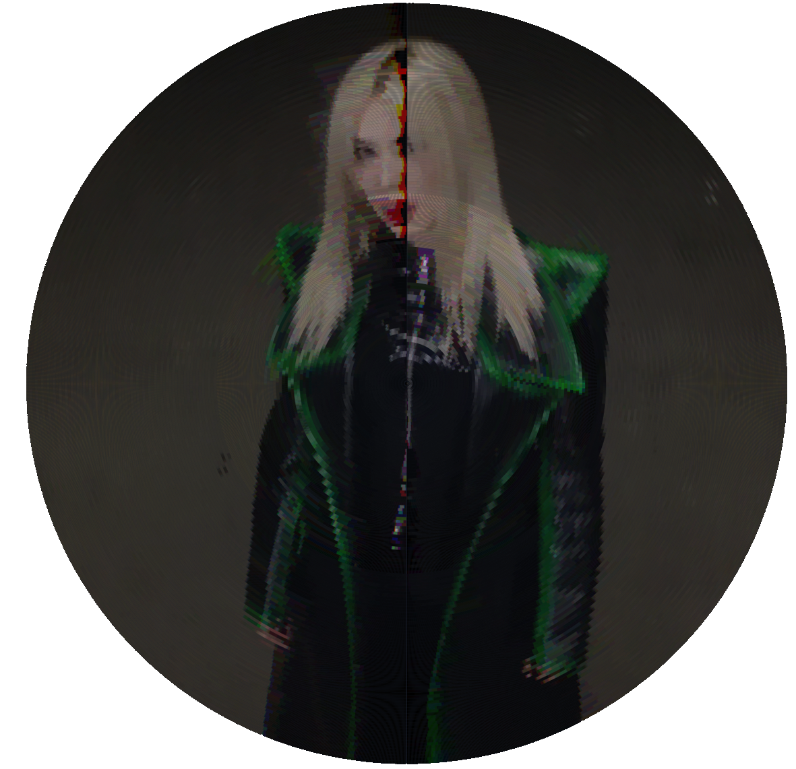
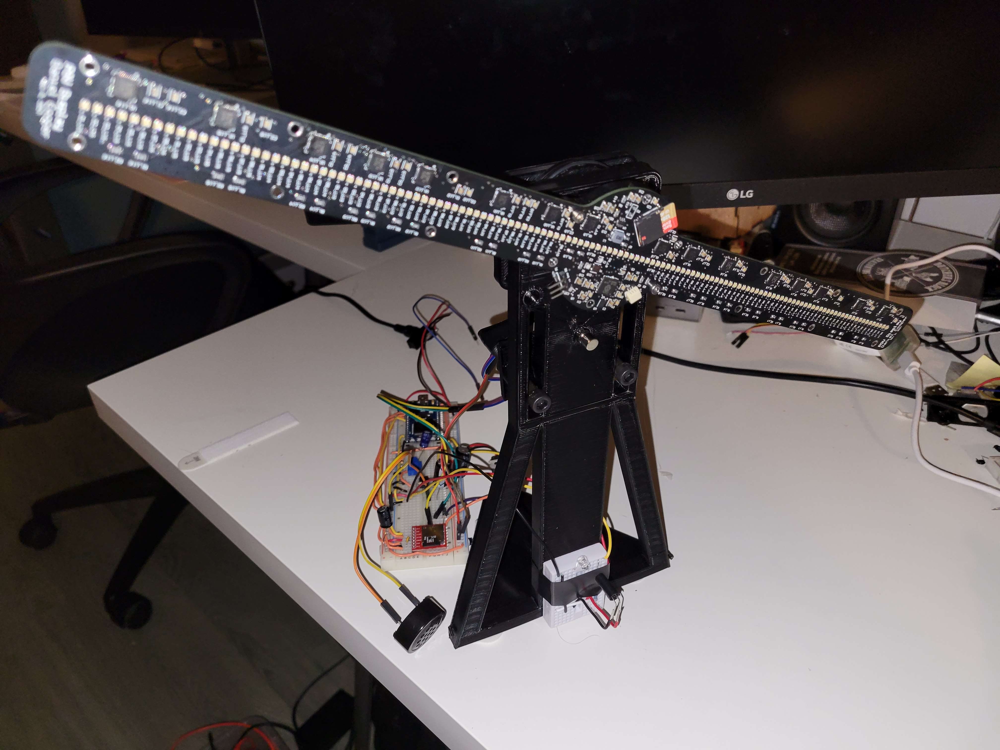

# POV Display

This project uses a custom PCB with an RP 2040 to control 128 RGB LEDs. The LEDs are driven
by 16 high-speed PWM LED driver ICs. The system is cabable of full-color video playback.

## Sections

[Embedded Software](#embedded-software)

[Video Generation](#video-generation)

[PCB Design](#pcb-design)

[Mechanical Construction](#mechanical-construction)

[Demo Video](#demo-video)

[Known Limitations](#known-limitations)

## Embedded Software

The RP2040 is an ARM M0+ microcontroller with two cores. The embedded software uses both cores
and has one preparing frame buffers while the other sends the data out at the right timing.

The system has two buffers for holding frames and will prepare the next buffer while the current
is read by the other core. The embedded software is designed to be as dumb as possible because
what dumb things lack in intelligence, they have in speed. There are only about 100 clock cycles
between bytes getting written out, so you won't see much code in the embedded software as every
line detracts from the needed speed.

#### File Reading

As such, the file that populates the frame buffers is designed to be as easy as possible for the
embedded code to read and display to the LEDs. The file is set up in such that all it has to do
is read the contents of each frame into the buffer, give a different pointer to each group (more
on this later), and send bytes to each group at the right interval. [Learn more about the binary file format](docs/fileFormat.md)

#### LED Output

The LED output core has three functions: 1. Send data to the right SPI peripheral at a specific
interval. 2. Update the interval based on how fast the board is rotating. 3. Request new frame
buffers when the current is exhausted.

#### Sending Data at a Specific Interval

There are four SPI channels for different regions of LED drivers (see PCB section for motivation).
They are controlled by PIO state machines with FIFO buffers enough to accommodate the entire
burst of data to all four ICs (8 bytes total). Given that bursts are so small but also don't fit
in 32 bits, they aren't well suited for DMA transfer as it would require setting up a new DMA
transfer for every 8 bytes - which comes with the setup overhead.

The RP2040 gives 2 FIFO buffers that can store 4 words of data. In this case, a word is defined
as a single byte, but the RP2040 allows for both FIFOs to be combined into one which allows the
burst to fit into a FIFO. This is key for meeting the timing requirements because the processor
doesn't need to wait for each bit to get written to the wire. By writting to each group's FIFO
buffers 32 bytes at a time, this gives much more headroom for the other activities while still
staying on time.

The actual timekeeping is using the 64-bit system timer which counts for each microsecond that has
passed. Usually, it needs to send a new burst every 25 microseconds, however an even number is
impossible to achieve because the exact timing depends on the rotational speed of the PCB. This
leads to small rounding errors which over the course of a frame consisting of ~41666us can lead to
up to 1.66ms of error in the timing over the course of the frame. This may sound small but it means
the frame can be off by as much as 7.2 degrees which will cause a visual oscillation.

Sub-microsecond precision is needed to stave off these unwanted side effects, and it accomplishes
this by multiplying the timer output by 32 (bit shifted, more precisely by 5 left). This gives 32
times the precision in terms of round-off error. Although floating point logic would eliminate
this need, the floating point calculations alone would easily consume all the clock cycles (3200)
that the loop needs to stay inside.

#### Updating the Interval

No matter the numeric precision of timing is, there will always be some error due to the mechanical
motion. Even a tight PID loop will have *some* error, so the interval update is a little more
complicated than dividing rotational period with number of bursts to write. The software tries to
blend the error so that it speeds up the next frame to make up for a slower current frame, or vice-
versa. This makes error easier on the eyes and looks like a shakey image as opposed to black regions
or chopped-off sections.

The software knows the rotational rate from a hall effect sensor mounted under the PCB. The sensor
provides a digital signal whether the magnet is in range or not, with some hysteresis. The software
measures when the magnet is in range and when it goes out of range. It corrects for the hysteresis
and finds the true center to align the frame vertically.

#### Requesting a New Frame

When the buffers are exhausted, it gets the next buffer filled from the other core. During this time
it applies the updated interval.

## Video Generation

Since the display itself just blindly reads from the file, the difficult task of generating the
video is moved offline to a more powerful computer where real-time conversion isn't necessary. Enter
the video encoder. View the code at tools/videoEncoder

#### Video Input

The encoder accepts any normal cartesian video (as opposed to polar like what it generates) and first
converts it into a series of still frames. This process is almost trivial thanks to [FFmpeg](https://ffmpeg.org/).

#### Frame Encoding

Next, the encoder converts each frame. To improve encoding performance, it does this independently
of previous frames allowing for parallelization. This leads to a decreased quality of output, see more
in the known limitations section.

The encoder simulates the path of the LEDs. It models the position of each one as it steps through
2000 values for angles of the PCB. The LED controller ICs expect packets of 2 bytes each, where the
first byte is the command and the second is the value. This allows us to control any LED and channel
at each step with few constraints.

The value may not be immediately appearent, however imagine that there is a scene with a red dress.
All the channels for each LED is likely to change often, however the red will change more because it
is the dominate color of that portion of the image. This allows us to change the red channel more
often than the others which visually gives a boost of detail and preserves contrast even if not 100%
color accurate.

Not only can it do this per-channel, but it can also do this per-LED for each controller IC. So what
software does is give each timestep a budget to change an LED. As each step passes, the available
budget is incremented by the timestep budget. It evaluates if it has enough budget to change a value
and if so, it samples LED colors and finds the channel that is most desperate to change. It generates
the command/value pair and adds it to the bursts it has generated and decrements the budget. This
mechanism allows it to optimize the bandwidth of the SPI SD card interface while "compressing" the
video.

LEDs are sampled by drawing a small arc representing the LED's path. This arc is drawn in a small
scratch image used for obtaining alpha values for each pixel. It then uses these alpha values to
sample the original image at the corresponding location to form a weighted-average to allow for
anti-aliasing of sorts.

#### Frame Rendering

To preview what the video will look like on the display, the video encoder will render each frame
by reading the sequence of bursts generated as if it were the display. It then draws each arc on
the work-in-progress frame. Since the real display takes advantage of interlacing the LEDs, the
render process will also draw the previous frame interlaced with the current.

These frames are stitched together using FFmpeg to form the preview video.

#### File Generation

Lastly, it generates the output file from the bursts generated during the encoding phase. It builds
the file by adding the headers and keeping to the format outlined [in this format](docs/fileFormat.md).
It does, however, add a small intermediate step. When copying the bursts over, it modifies the values.

The human eye does percieve luminous intensity linearly, rather it is an exponential relationship
where the eye is more sensitive to changes in intensity when light is dim than when it is bright.
The software applies correction for this by sampling from a lookup table and interpolating between
entries.

## PCB Design

The PCB was designed in Altium Designer. You can view the design files in the pcb/ folder. As mentioned,
the design uses an RP2040 at the center. It is connected to a microSD card slot with hardware SPI pins.
A digital hall effect sensor tells the microcontroller when the board has passed the vertical position.

#### LED Controllers

After conducting an extensive search for LED controller ICs, I settled on the PCA9957HNMP from NXP. It
offers daisy-chain connection, SPI interface (that acts like a shift register while CS is held low), and
most importantly - high speed PWM at 31kHz. Most LED controller ICs have 10+ bit PWM but not only does that
not align well in the memory of the microcontroller, but it makes them slower. The speed comes at the
expense of color quality at low intensities, but speed is most important for a fast-spinning device like
this. The LED controller ICs also have constant current drivers for calibrating the colors and controlling
brightness without sacrificing PWM resolution.

#### Power Rails

The PCB is intended to be powered externally with a device such as a slip ring with 5-6V. A low dropout
linear regulator provides the 3.3V to the digital ICs, and a separate switching regulator provides 3.7V
for the LEDs.

## Mechanical Construction

The mechanical construction is crude, so I won't detail it much. The most notable component is the slip
ring that allows the board to continuously rotate without tangling wires. A small DC motor is connected
with a belt drive to spin the assembly. This DC motor is driven by an external circuit that performs
closed-loop control of the motor using PID. Ideally, a brushless motor would be used with a precision
driver, but I honestly didn't expect the rest of the project to work out as well as it did within the
time constraints.

## Demo Video

Coming soon!

## Known Limitations

Although the project has exceeded my expectations, it does have some notable limitations for those who
come across my work.

* The SPI interface for SD cards is slow (~11Mbps max) and it is the limiting factor for resolution and framerate.
Consider using a microcontroller that has an sdio interface.
* The power traces are not sized properly for the current ripple caused by the LED PWM. Make larger PCB traces and
larger bypass capacitors to not cause excessive ripple on the ground net.
* Consider using a servo motor for precision speed control. The image shakes a little still.
* Instead of using a slip ring, inductive power transfer would be better because I am exceeding the rated speed of
the slip ring by over a factor of two.
* Wireless communication such as WiFi would allow debugging while spinning, and upload of files to high-speed flash
memory (so that the SD card doesn't fly out).
* The PCB doesn't natively interlace the LEDs. I have performed this by mechanically offsetting the PCB, but this
leads to a slight imbalance.